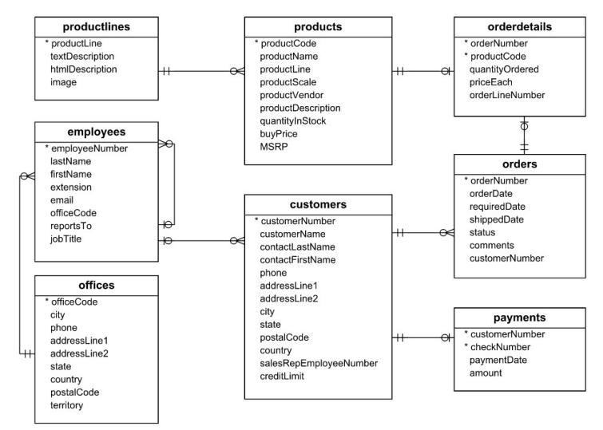

# Data Modeling for Analytics using dbt on AWS RDS (Star Schema & OBT)

## Project Overview

This project demonstrates the implementation of two common analytical data modeling patterns – the Star Schema and the One Big Table (OBT) – using dbt (Data Build Tool) Core. The focus is on applying structured transformation logic and data quality validation directly within a cloud-based relational database (PostgreSQL on AWS RDS). It showcases a practical dbt workflow for converting source relational data into reliable, analytics-ready datasets.

## Objectives

* Demonstrate the setup and configuration of a dbt Core project targeting PostgreSQL on AWS RDS.
* Implement a Star Schema model, including fact and dimension tables with surrogate keys, using dbt.
* Implement a denormalized One Big Table (OBT) model using dbt.
* Utilize dbt's SQL and Jinja templating for efficient and maintainable model development.
* Leverage common dbt packages (`dbt-utils`, `dbt-date`) for standard functions.
* Define and execute data quality tests using dbt's `schema.yml` functionality to ensure model integrity.
* Illustrate the concept and execution of in-database transformation orchestrated by dbt within a cloud environment.
* Highlight the structural differences and potential use cases of Star Schema vs. OBT models.

## Architecture & Workflow

1.  **Source Data:** The project assumes the `classicmodels` sample dataset is pre-loaded into a designated schema (e.g., `classicmodels`) within an AWS RDS PostgreSQL instance.
2.  **dbt Connection:** dbt Core connects to the RDS instance via credentials defined in the dbt profile (`profiles.yml`).
3.  **Transformation Logic:** Models defined in `.sql` files within the dbt project `/models` directory contain the SQL and Jinja logic for transformation.
4.  **Execution (In-Database):** `dbt run` compiles the models into standard SQL and sends these statements to the AWS RDS PostgreSQL instance. The **database engine executes** the transformations (joins, functions, aggregations).
5.  **Materialization & Serving:** The resulting Star Schema and OBT models are materialized as new tables within dedicated schemas (e.g., `classicmodels_star_schema`, `classicmodels_obt`) in the **same AWS RDS instance**, making them immediately available for querying by downstream tools.
6.  **Testing:** `dbt test` executes predefined data quality tests (defined in `schema.yml`) as SQL queries against the materialized tables within RDS.

### Source Data Schema (ERD)

The source `classicmodels` database schema follows this structure:



## Technologies Used

* **Data Transformation:** dbt Core
* **Database:** PostgreSQL (hosted on AWS RDS)
* **Cloud Platform:** Amazon Web Services (AWS)
* **Languages:** SQL, Jinja, YAML
* **dbt Packages:** `dbt-utils`, `dbt-date`
* **Environment:** Jupyter Notebook (for lab execution), Standard Command Line (for dbt commands)

## dbt Project Structure

The key files and directories within the `classicmodels_modeling` dbt project:

* `dbt_project.yml`: Main dbt project configuration (name, version, paths, model configurations).
* `packages.yml`: Declares dbt package dependencies (`dbt-utils`, `dbt-date`).
* `models/`: Contains the SQL model definitions.
    * `obt/`: Subdirectory for One Big Table models.
        * `orders_obt.sql`: SQL definition for the denormalized OBT.
        * `schema.yml`: Defines schema and tests for the OBT model.
    * `star_schema/`: Subdirectory for Star Schema models.
        * `fact_orders.sql`: SQL definition for the central fact table.
        * `dim_customers.sql`, `dim_employees.sql`, `dim_offices.sql`, `dim_products.sql`, `dim_dates.sql`: Dimension table definitions.
        * `dates.sql`: Helper model using `dbt_date` package macro.
        * `schema.yml`: Defines schemas and tests for Star Schema models.
* `target/`: *(Generated by dbt, typically ignored via `.gitignore`)* Contains compiled code and run artifacts.
* `dbt_packages/`: *(Generated by dbt, typically ignored via `.gitignore`)* Contains downloaded package code.
* `logs/`: *(Generated by dbt, typically ignored via `.gitignore`)* Contains dbt run logs.

*(Note: `profiles.yml` contains database credentials and is typically stored securely outside the project repo, e.g., in `~/.dbt/`)*

## Models Implemented

### 1. Star Schema (`classicmodels_star_schema`)

A dimensional model optimized for BI and reporting:

* **Fact Table:** `fact_orders` (granularity: order line item)
* **Dimension Tables:** `dim_customers`, `dim_employees`, `dim_offices`, `dim_products`, `dim_dates`
* **Features:** Uses surrogate keys generated via `dbt_utils.generate_surrogate_key`. Date dimension generated via `dbt_date`.

### 2. One Big Table (OBT) (`classicmodels_obt`)

A denormalized table designed for potentially simpler/faster queries on specific use cases:

* **Table:** `orders_obt`
* **Features:** Pre-joins data from multiple source tables (`orders`, `orderdetails`, `products`, `productlines`, `customers`, `employees`).

## Data Quality & Testing

Data tests were defined in `schema.yml` files to ensure the integrity of the materialized models within RDS. Examples include:

* `unique`: Testing primary key uniqueness.
* `not_null`: Ensuring key columns are never null.
* `dbt_utils.unique_combination_of_columns`: Validating composite primary keys (used for OBT).

Tests are executed via the `dbt test` command.

## Setup & Usage

To replicate this project environment and run the dbt models:

1.  **Prerequisites:**
    * **Software:** dbt Core installed (e.g., `pip install dbt-postgres`). Access to a command line/terminal. Git for cloning.
    * **Database:** An accessible PostgreSQL database instance (like AWS RDS).
    * **Source Data:** The `classicmodels` sample database must be loaded into the target PostgreSQL instance within a schema named `classicmodels` (or adjust the `source_schema` variable in `dbt_project.yml`).
        * *(The `classicmodels` dataset can typically be found online, for example, via mysqltutorial.org - search for "mysql sample database")*

2.  **Configuration:**
    * Clone this repository: `git clone <your-repo-url>`
    * Navigate to the `classicmodels_modeling` directory: `cd <your-repo-name>/classicmodels_modeling`
    * Configure your dbt profile (`~/.dbt/profiles.yml`) with the connection details (host endpoint, database name, username, password, schema) for your target PostgreSQL database. Refer to the dbt documentation for details. A sample structure was provided in the original lab's `scripts/profiles.yml`. **Ensure credentials are handled securely and not committed to Git.**

3.  **Install Dependencies:**
    ```bash
    dbt deps
    ```

4.  **Run Models:**
    * To run only the Star Schema models: `dbt run --select star_schema`
    * To run only the OBT models: `dbt run --select obt`
    * To run all models: `dbt run`

5.  **Run Tests:**
    * To run tests on Star Schema models: `dbt test --select star_schema`
    * To run tests on OBT models: `dbt test --select obt`
    * To run all tests: `dbt test`

## Discussion: Star Schema vs. OBT Trade-offs

This project provides a basis for comparing these modeling approaches:

* **Star Schema:** Offers a structured, normalized approach that is generally easier to maintain, understand for BI tools, and potentially uses less storage. Requires joins at query time.
* **One Big Table (OBT):** Can simplify queries for end-users or specific tools by pre-joining data. May improve query performance in some cases but can lead to wide tables, data redundancy, increased storage, and more complex update logic.

The optimal choice depends heavily on the specific analytical requirements, query patterns, downstream tools, and team preferences.

## Conclusion

This project demonstrates a complete workflow using dbt Core to perform reliable, tested, in-database transformations within AWS RDS PostgreSQL. It covers the practical implementation of Star Schema and OBT data models, highlighting key dbt features and data engineering best practices for creating analytics-ready datasets in a cloud environment.
